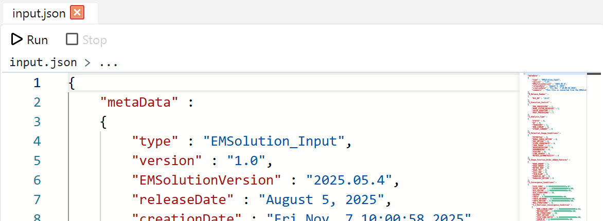
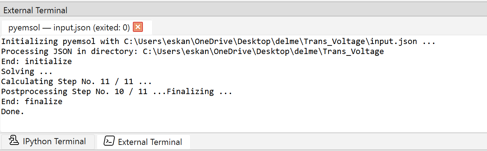

To run an EMSolution simulation in pyemsi, start from the Explorer widget in an opened workspace.

If you have not installed the `pyemsol` package yet, see [Installation](/docs/docs/installation) first.

## Run An Input Control File

1. In the Explorer widget, double-click the EMSolution input control file in JSON format.
2. The file opens in the dedicated input viewer.
3. Click the Run button  in the viewer toolbar.

When you click Run, pyemsi first saves the input file if it has unsaved changes, then launches the simulation with `pyemsol` in the External Terminal.

## External Terminal Output

The External Terminal shows the simulation progress in detail while the job is running.

This makes it possible to monitor execution messages directly from inside pyemsi without blocking the rest of the GUI.

