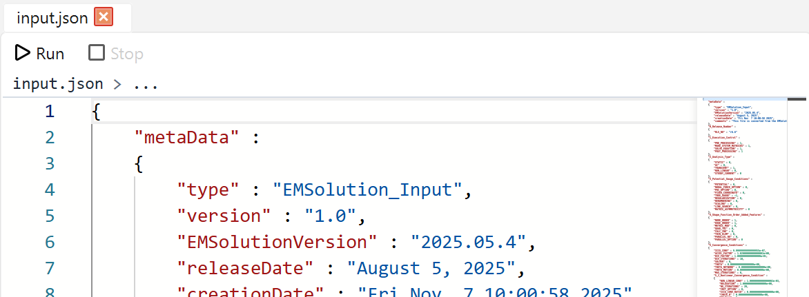
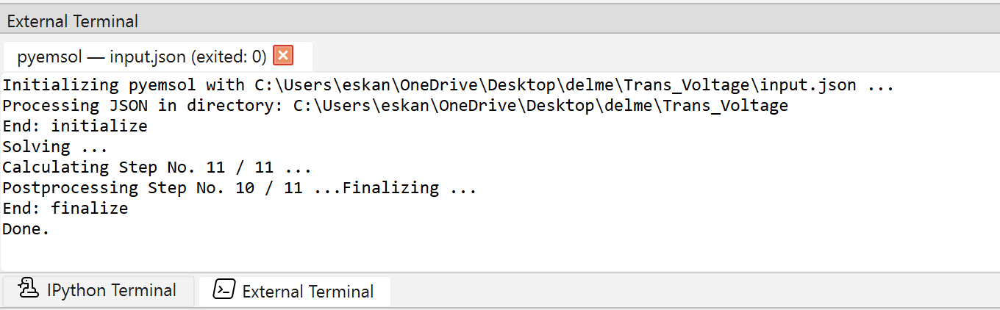

To run an EMSolution simulation in pyemsi, start from the Explorer widget in an opened workspace.

pyemsi can run a simulation two ways: with the `pyemsol` Python package, or with a standalone `EMSolution.exe` you already have installed. If you have not installed `pyemsol`, see [Installation](/docs/docs/installation), or use the `EMSolution.exe` backend instead — it needs no `pyemsol` install.

## Run An Input Control File

1. In the Explorer widget, double-click the EMSolution input control file in JSON format.
2. The file opens in the dedicated input viewer.
3. Click the Run button  in the viewer toolbar.

When you click Run, pyemsi first saves the input file if it has unsaved changes, then launches the simulation in the External Terminal using the selected backend (see below).

Click the Stop button  at any time, including mid-simulation, to terminate the running job.

## Choosing A Run Backend

Next to Run/Stop in the input viewer's toolbar are two combo boxes:

- **Backend**: `Pyemsol` or `EMSolution.exe`.
- **Style** (only shown when Backend is `EMSolution.exe`): `Background` or `Window`.

Changing either only affects the next Run click in that viewer — it does not change your saved defaults.

To change the defaults used every time (and, for `EMSolution.exe`, to tell pyemsi where the executable is installed), open **Settings > EMSolution Run Settings...**:

- **Backend**: which program runs simulations by default.
- **Executable Path**: the location of your `EMSolution.exe`. Use **Browse...** to select it, and **Check** to verify pyemsi can launch it.
- **Style**: the default `Background`/`Window` choice for the `EMSolution.exe` backend.

`Background` runs without opening any extra window; `Window` also shows EMSolution's own native progress window. Depending on your installed `EMSolution.exe` build, its own window may appear even in `Background` mode — that is controlled by the executable itself, not by pyemsi.

## External Terminal Output

The External Terminal shows the simulation progress in detail while the job is running, whichever backend you chose.

This makes it possible to monitor execution messages directly from inside pyemsi without blocking the rest of the GUI.

