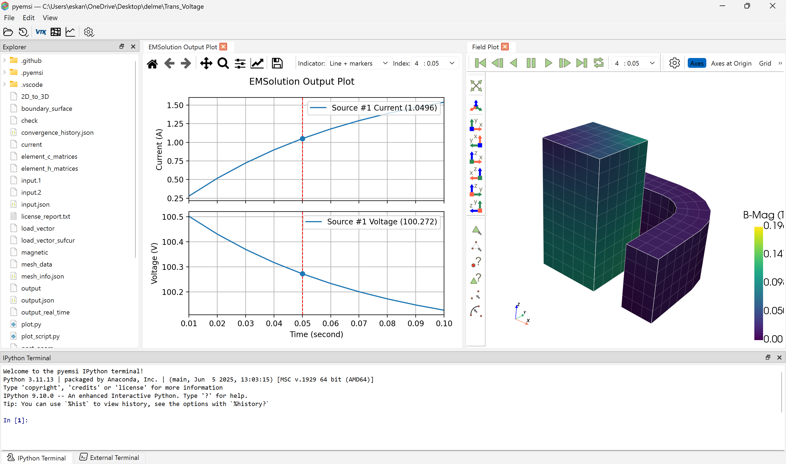

pyemsi is a Windows desktop environment for EMSolution simulation work. It is designed more like a lightweight IDE than a single-purpose viewer, combining workspace browsing, file editing, Python execution, plotting, field visualization, and simulation-oriented tools in one interface.

## Workspace-Centered Interface

The main window is organized around an EMSolution workspace.

- The Explorer dock shows the files and folders in the active simulation workspace.
- Files open in tabs, so you can keep multiple inputs, outputs, scripts, plots, and field views available at the same time.
- The interface is intended to support the full simulation workflow, from inspecting project files to launching analysis runs and reviewing results.

In addition to standard file tabs, pyemsi provides specialized handling for important EMSolution files. For example, input control files in JSON format and output JSON files are not treated as plain text only; pyemsi can attach workflow-specific actions and viewers to them. These dedicated workflows are documented in their own pages.

## Built-In Simulation Tools

pyemsi includes several tools that are useful during model preparation, execution, and post-processing.

- Python files can be opened and executed directly from the GUI.
- EMSolution output waveforms can be displayed as plots using Matplotlib.
- Field data can be inspected in an interactive 3D view powered by PyVista.
- FEMAP neutral files can be converted into VTK-supported formats for visualization and downstream analysis.

For the FEMAP conversion workflow, see [FemapConverter](/docs/api/FemapConverter).

For the VTK and field visualization API used by pyemsi, see [Plotter](/docs/api/Plotter).

## Terminals

pyemsi provides two terminal docks with different purposes.

### IPython Terminal

The IPython Terminal is embedded directly inside the GUI and is intended for interactive, lightweight tasks.

- It is useful for running short Python snippets without leaving the application.
- It gives you access to the current GUI session, which makes it convenient for operations such as opening files, adding new tabs, creating plots, or interacting with the main window programmatically.
- It is the recommended place for small automation tasks, quick inspections, and installation commands such as installing `pyemsol` into the pyemsi environment.

### External Terminal

The External Terminal is designed for longer-running or computationally heavier processes.

- It runs commands in a separate process, so the GUI remains responsive.
- Each launched process appears in its own terminal tab.
- It is the recommended place for running `pyemsol` simulations and other non-blocking execution tasks.

## What pyemsi Brings Together

At a high level, pyemsi brings together the parts of an EMSolution workflow that are usually scattered across separate tools:

- workspace navigation through the Explorer
- tab-based access to files and viewers
- interactive Python access through IPython
- non-blocking simulation runs through the External Terminal
- waveform plotting with Matplotlib
- field visualization with PyVista
- FEMAP-to-VTK conversion for visualization workflows

## Related Pages

- [FemapConverter](/docs/api/FemapConverter)
- [Plotter](/docs/api/Plotter)