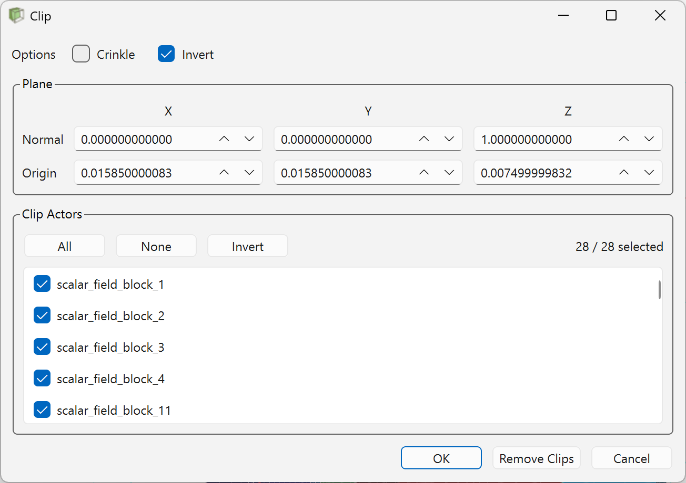

The `Clip` tool lets you cut the currently rendered plot with an interactive plane so you can inspect internal regions without rebuilding the field view. You can open it from the plotter display toolbar using  `Clip`.

## Available Controls

| Control | Description |
| --- | --- |
| `Crinkle` | Use crinkle clipping instead of a smooth plane cut. |
| `Invert` | Reverse which side of the plane remains visible after clipping. |
| `Normal` | Set the plane normal with `X`, `Y`, and `Z` values. |
| `Origin` | Set the plane position with `X`, `Y`, and `Z` coordinates. |
| Interactive plane widget | Drag, move, or rotate the plane directly in the viewport for live adjustment. |
| `Clip Actors` list | Choose which currently visible plot actors are affected by the clip. |
| `All` | Select every listed actor for clipping. |
| `None` | Clear the actor selection so no listed actors are clipped. |
| `Invert` in `Clip Actors` | Reverse the current actor selection. |
| `OK` | Keep the current clip and close the dialog. |
| `Cancel` | Discard edits from the current open session and restore the previously open clip state. |
| `Remove Clips` | Remove the active GUI clip and restore the original actor datasets. |

## Typical Workflow

1. Click  `Clip` in the display toolbar.
2. Move or rotate the interactive plane in the viewport, or enter exact `Normal` and `Origin` values in the dialog.
3. Toggle `Crinkle` or `Invert` if the default cut direction or clip style is not what you need.
4. Use the `Clip Actors` list when you want the plane to affect only part of the rendered scene.
5. Click `OK` to keep the clip, `Cancel` to restore the state from when the dialog was opened, or `Remove Clips` to clear clipping entirely.

	<iframe
		style={{ width: '100%', height: '100%' }}
		src="https://www.youtube.com/embed/JTesfkeI7XU"
		title="Query Point demo"
		frameBorder="0"
		allow="accelerometer; autoplay; clipboard-write; encrypted-media; gyroscope; picture-in-picture; web-share"
		allowFullScreen>
	</iframe>

## Behavior Notes

- The dialog manages one active GUI clip plane at a time.
- Clipping updates live while you move the plane widget, change numeric fields, toggle options, or change actor selection.
- Clipping is actor-specific, so selected actors can be clipped while other actors remain unchanged.
- `Cancel` restores the clip state that existed when the dialog was opened, including the case where no clip was active.
- `Remove Clips` clears the active clip, restores the original datasets, and resets the dialog fields to the default plane state.

## When To Use Clipping

Clipping is useful when you want to:

- inspect internal field structure hidden by outer geometry
- reduce visual obstruction before sampling or querying
- isolate part of a multi-actor scene without changing the original plot configuration
- prepare clearer screenshots of a cross-section or internal feature
